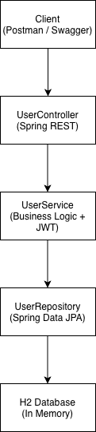

# Users API – Evaluación Java

API RESTful desarrollada en Spring Boot para el registro de usuarios, cumpliendo con los requisitos definidos en la evaluación técnica.

---

## 🚀 Tecnologías utilizadas

- Java 17 (LTS)
- Spring Boot 3
- Spring Web
- Spring Data JPA (Hibernate)
- Spring Security
- JWT (JSON Web Token)
- H2 Database (en memoria)
- Bean Validation
- Lombok
- Swagger / OpenAPI
- Maven
- JUnit 5 + MockMvc

---

## 📋 Descripción

La aplicación expone un endpoint REST para el **registro de usuarios**, validando:
- Formato de correo electrónico mediante expresión regular
- Formato de contraseña mediante expresión regular configurable
- Unicidad del correo en la base de datos

Todos los endpoints aceptan y retornan **JSON**, incluidos los mensajes de error.

Formato estándar de error:
```json
  { "mensaje": "mensaje de error" }
```

---

## 📦 Modelo de datos

Usuario
- id (UUID)
- name
- email (único)
- password (encriptada)
- created
- modified
- last_login
- token (JWT)
- isActive
- phones

Teléfono
- number
- citycode
- contrycode

---

## 🔐 Seguridad

- La contraseña se almacena en forma encriptada usando BCrypt.
- Al registrar un usuario se genera un JWT, el cual es persistido junto al usuario.
- El endpoint de registro es público.
- Swagger y H2 Console están habilitados solo para efectos de prueba.

---

## 🧪 Base de datos

- Base de datos en memoria H2
- Se inicializa automáticamente al levantar la aplicación

Acceso a consola H2:
```bash
http://localhost:8080/h2-console
```

JDBC URL:
```makefile
jdbc:h2:mem:usersdb
```
---

## 📖 Documentación API (Swagger)

Una vez levantada la aplicación, se puede acceder a Swagger en:
```bash
http://localhost:8080/swagger-ui.html
```
---

## ## ▶️ Cómo levantar la aplicación (IntelliJ)

### Requisitos
- Java 17 (JDK)
- IntelliJ IDEA

### Pasos
1. Abrir el proyecto en IntelliJ (carpeta que contiene `pom.xml`).
2. Esperar a que Maven descargue dependencias (si no lo hace: ventana Maven → Reload).
3. Verificar JDK 17:
    - `File → Project Structure → Project → Project SDK: 17`
4. Ejecutar la clase:
    - `UsersApiApplication` (Run)

### URLs
- Swagger UI: `http://localhost:8080/swagger-ui.html`
- (Opcional) H2 Console: `http://localhost:8080/h2-console`
    - JDBC URL: `jdbc:h2:mem:usersdb`
    - User: `sa`
    - Password: *(vacío)*
  
---

## 🧪 Pruebas con Postman

### 1) Crear request
- Método: **POST**
- URL: `http://localhost:8080/api/users`
- Headers:
    - `Content-Type: application/json`

### 2) Body (raw → JSON)
```json
{
  "name": "Juan Rodriguez",
  "email": "juan@rodriguez.org",
  "password": "Password1",
  "phones": [
    {
      "number": "1234567",
      "citycode": "1",
      "contrycode": "57"
    }
  ]
}
```

### 3) Respuesta esperada (201 CREATED)
```json
   {
   "id": "uuid",
   "created": "2025-01-01T12:00:00",
   "modified": "2025-01-01T12:00:00",
   "last_login": "2025-01-01T12:00:00",
   "token": "jwt",
   "isactive": true
   }
```

### 4) Caso correo duplicado

Repite la misma request (mismo email).
- Código esperado: 409 CONFLICT
- Body esperado:
```json
   {
   "id": "uuid",
   "created": "2025-01-01T12:00:00",
   "modified": "2025-01-01T12:00:00",
   "last_login": "2025-01-01T12:00:00",
   "token": "jwt",
   "isactive": true
   }
```

### 5) Caso password inválida

Ejemplo de password inválida:
```json
    {
    "id": "uuid",
    "created": "2025-01-01T12:00:00",
    "modified": "2025-01-01T12:00:00",
    "last_login": "2025-01-01T12:00:00",
    "token": "jwt",
    "isactive": true
    }
```

### 6) Código esperado: 400 BAD REQUEST

Body esperado:
```json
  { "mensaje": "Formato de contraseña inválido" }
```

---

##  ❌ Errores posibles

| Caso              | Código | Mensaje                        |
|-------------------|--------|--------------------------------|
| Correo duplicado  | 409    | El correo ya registrado        |
| Email inválido    | 400    | Formato de correo inválido     |
| Password inválida | 400    | Formato de contraseña inválido |
| JSON inválido     | 400    | JSON inválido                  |

---

## 🧪 Tests

Se incluyen pruebas unitarias/integración utilizando:
- SpringBootTest
- MockMvc
- H2 en memoria
- 
Casos cubiertos:
- Registro exitoso
- Correo duplicado
- Password inválida
- JSON mal formado
---

## 🧩 Diagrama de la solución

Arquitectura en capas:


